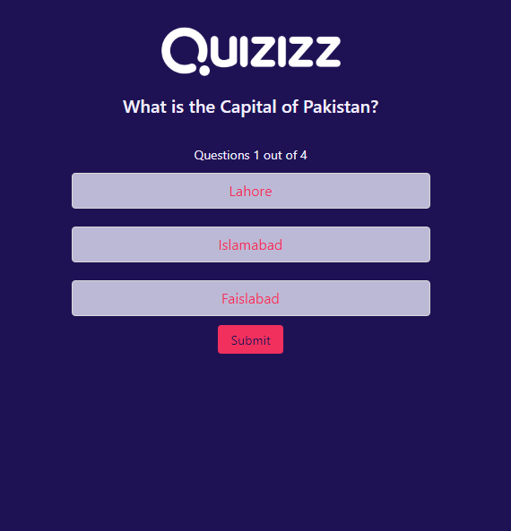

  
  
  
  ## Quiz Application built with react
  
  ##### Review Quiz : [Quiz](quizapp.kk2111436.now.sh)
  
  

  
  ---
  ## About
  
This project created with Ant Design and React js. You can play Easy quiz here and can see your score.
This quiz game is designed to increase learning by requiring students to write a multiple-choice question..

## Available Scripts

In the project directory, you can run:

### `npm start`

Runs the app in the development mode. 
Open [http://localhost:3000](http://localhost:3000) to view it in the browser.

The page will reload if you make edits. 
You will also see any lint errors in the console.

### `npm test`

Launches the test runner in the interactive watch mode. 
See the section about [running tests](https://facebook.github.io/create-react-app/docs/running-tests) for more information.

### `npm run build`

Builds the app for production to the `build` folder. 
It correctly bundles React in production mode and optimizes the build for the best performance.

The build is minified and the filenames include the hashes. 
Your app is ready to be deployed!

Technology Stack
=================
> List the front-end and back-end technologies used in the project.
* React js
* Ant Design
* Node js
* Visual code

Browser/Software Support
=================
* Internet Explorer 11
* Chrome (latest version)
* Firefox (latest version)
* Safari (latest version)

## ✍️ Authors 
- [@Kainat](https://github.com/kainatn) - Idea & Initial work
